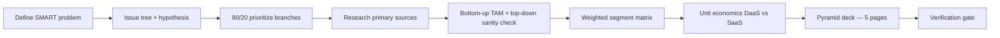

# Methodology Notes — Phase 0

> Completed: 2026-06-24. Resources from `AGENT_PROMPT.md` Phase 0.  
> Purpose: Internalize consulting methodology **before** writing analysis files.

---

## Resources reviewed

| # | Resource | Status | Notes |
|---|----------|--------|-------|
| 1 | [Victor Cheng — Case Interview Workshop Part 1](https://www.youtube.com/watch?v=fBwUxnTpTBo) | Reviewed (via CaseInterview.com companion material) | Hypothesis-driven case flow, Core Four frameworks, issue-tree discipline |
| 2 | [Crafting Cases — Market Sizing Breakdown](https://www.youtube.com/watch?v=N5SLtfVoZAM) | Reviewed (via Crafting Cases Estimation Blueprint + course page) | 5-step Estimation Blueprint, binding-constraint logic, Assumption Playbook |
| 3 | [Hacking the Case Interview — Issue Trees](https://www.hackingthecaseinterview.com/pages/issue-trees) | Read in full | MECE, ROOTS check, 4 breakdown methods, 80/20 |
| 4 | [StrategyCase — Market Sizing 6-Step Method](https://strategycase.com/market-sizing-case-interviews/) | Read in full | Clarify → structure → assume → calculate → sanity-check → interpret |
| 5 | [McKinsey — Interviewing / Problem Solving](https://www.mckinsey.com/careers/interviewing) | Reviewed (via McKinsey 7-step process reference) | Problem definition, hypothesis trees, pyramid synthesis, workplan |

---

## 1. Opening a case — Victor Cheng (Workshop Part 1)

### Core flow: Listen → Verify → Structure → Hypothesize → Test

1. **Listen actively** — First sentences of the prompt carry the most signal. Write keywords, not full sentences.
2. **Verify understanding** — Paraphrase the objective and constraints back to the interviewer before structuring. "Don't solve the wrong problem."
3. **Structure before calculating** — Match problem type to framework, describe key components (don't name-drop the framework), **draw** the structure.
4. **State a hypothesis early** — Interviewers cannot read your mind. Say it out loud once you have enough to prioritize.
5. **Use the tree to drive data gathering** — After forming a hypothesis, ask only the questions needed to prove/disprove it (subset of full framework questions).

### Victor Cheng's "Core Four" frameworks

| Framework | When to use |
|-----------|-------------|
| Profitability | Revenue/cost diagnosis |
| Business Situation | Market entry, new product, growth, competitive response |
| M&A | Acquire / merge decisions |
| Supply / Demand (Capacity) | Industry capacity, build/shutdown, demand shifts |

**Pixxel maps to Business Situation** (commercial strategy for a company transitioning business model) with embedded market sizing and profitability (DaaS vs SaaS unit economics).

### Framework discipline (critical)

- **Acknowledge all branches** — Never ignore a branch; say which you'll start with and why.
- **Quantitative frameworks (profitability):** Use process of elimination — one or two data points can rule out a branch. Size contribution of each driver (e.g., "80% revenue, 20% cost") before drilling deep.
- **Conceptual frameworks (business situation):** Do NOT exhaust every branch before drilling. Form hypothesis from first interesting insight, then let hypothesis drive remaining questions.
- **Hypothesis-driven phase** asks a **subset** of framework questions — not the full 101-question checklist.

### Opening checklist (apply in Phase 1)

- [ ] Restate client problem in one SMART question
- [ ] State testable hypothesis before building full tree
- [ ] Draw 3–4 MECE top-level branches tailored to Pixxel (not generic cookie-cutter)
- [ ] Star 2–3 priority branches (80/20)
- [ ] Announce starting branch + what data will test it

---

## 2. Issue trees — Hacking the Case Interview

### Definition

Visual diagram: **root question → 3–5 MECE branches → sub-branches** until each node is answerable with data.

Two types:
- **Diagnostic ("why?")** — Find root cause (structuring phase)
- **Solution ("how?")** — Generate fixes once cause is known

### 5-step build process

1. Define root question (specific, answerable)
2. Split into 3–5 major branches (one breakdown method per level)
3. Add sub-branches (2–3 levels sufficient)
4. Check MECE + apply 80/20 (star priorities)
5. Present tree; state which branch to investigate first

### Four breakdown methods

| Method | Best for | Example |
|--------|----------|---------|
| **Math** | Quantifiable problems | Profit = Revenue − Costs; Revenue = Price × Quantity |
| **Segment** | Performance varies by group | By geography, customer type, product line |
| **Process** | Operations, funnels | Order → manufacture → ship → deliver |
| **Stakeholder** | Multi-party / industry | Company, customers, competitors, regulators |

**Rule:** Math breakdowns are most reliably MECE. When no formula exists: pick one driver, multiply by unit conversion (e.g., Revenue = Customers × Revenue/customer).

### ROOTS check (15 seconds before presenting)

| Letter | Check |
|--------|-------|
| **R** | Root question — tree answers the *exact* question asked |
| **O** | One logic per level — don't mix math + segment on same layer |
| **O** | Overlaps removed — no idea fits two branches |
| **T** | Totality covered — no plausible cause missing |
| **S** | Star priorities — 2–3 branches to investigate first |

### Common mistakes to avoid

1. Non-MECE first layer (biggest error)
2. Too many branches (>5 per level)
3. Vague labels ("competitive dynamics" vs "Are competitors undercutting on price?")
4. Skipping levels (jumping to recommendation without testing)
5. Generic memorized framework forced onto case
6. Brainstorm dump instead of logical hierarchy

### Top-down vs bottom-up in trees

- **Top-down structuring** — Default for case opening (don't know answer yet)
- **Bottom-up** — For estimation nodes within a branch (market sizing sub-tree)
- **Strong practice:** Structure top-down, sanity-check key branches bottom-up before committing

---

## 3. Market sizing — StrategyCase 6-step + Crafting Cases Estimation Blueprint

### StrategyCase 6-step method

| Step | Action |
|------|--------|
| 1. Clarify | Units (revenue vs volume)? Geography? Time period? Restate in one sentence. |
| 2. Structure | Choose top-down or bottom-up; lay out 3–5 multiplying drivers **before** math |
| 3. Assume | Round aggressively (10%, 25%, 50%); anchor each assumption in one-line rationale |
| 4. Calculate | Step-by-step, narrate aloud, strip trailing zeros |
| 5. Sanity-check | Compare to benchmark or reverse-engineer implied behavior |
| 6. Interpret | State answer + strategic "so what" (not just a number) |

### Crafting Cases Estimation Blueprint (5 core steps — aligns with above)

1. **Clarify** — Scope, units, time horizon; ask clarifying questions strategically
2. **Structure** — MECE breakdown; communicate approach before calculating
3. **Assume** — Assumption Playbook: anchor in benchmarks, personal logic, or provided data
4. **Calculate** — Clean mental math; balance rounding direction (some up, some down)
5. **Reality-check** — Plausibility test; sensitivity on key drivers

**Structuring Toolbox:** segment effectively, break percentage buckets, identify binding constraint.

### Top-down vs bottom-up

| | Top-down | Bottom-up |
|---|----------|-----------|
| Start | Large population (India farmable land, ag GDP) | Single unit (hectare, insurer, enterprise farm) |
| Direction | Narrow by filters | Scale up |
| Best for | Consumer / demand-side | B2B, supply-side, capacity-driven |
| Risk | Compounding % errors | Wrong base unit |

**Binding constraint rule:** If demand pool is the anchor → top-down. If supply/capacity defines market → bottom-up. **When in doubt, run both and reconcile** — >2–3× divergence signals a structural gap.

### Core formulas (memorize patterns, not exact stats)

```
Market size = Population × penetration × frequency × price
Revenue     = Units × price
Bottom-up   = # locations × customers/location × spend
Capacity    = capacity/unit × # units × utilization × price
Replacement = installed base ÷ replacement cycle
```

### Accuracy standard

- Within **one order of magnitude** = acceptable
- Within **~25%** of reality = excellent
- **Process > precision** — well-structured rough estimate beats lucky precise number

### Five mistakes to avoid

1. Memorizing rigid templates instead of thinking
2. Overcomplicating math (false precision)
3. Jumping to calculation without stated structure
4. Unrealistic assumptions (every person buys 5 cars/year)
5. Going silent — narrate every step

### Firm note (for interview defense, not deck)

McKinsey rarely asks standalone market sizing; BCG/Bain do. Pixxel deck TAM still uses this method because **real consulting engagements** size markets this way.

---

## 4. McKinsey problem-solving process (7 steps)

| Step | Application to Pixxel case |
|------|---------------------------|
| 1. **Define problem** | SMART question: "How should Pixxel prioritize verticals and monetization to reach profitable scale in India by FY2028?" |
| 2. **Structure** | Issue tree (Phase 1) — hypothesis tree when enough knowledge exists |
| 3. **Prioritize** | 80/20 + impact/ease matrix on branches |
| 4. **Plan analyses** | Workplan: TAM model, segment matrix, unit economics table |
| 5. **Conduct analyses** | Phases 2–3 with primary sources |
| 6. **Synthesize** | Pyramid Principle — governing thought per page |
| 7. **Recommend** | Actionable FY2026–28 roadmap with metrics |

### Hypothesis tree criteria (McKinsey)

A good hypothesis must be:
- **Testable** — provable/disprovable with data
- **Debatable** — not a statement of fact
- **Meaningful if reversed** — opposite outcome would change the recommendation
- **Non-obvious to CEO** — not naive
- **Action-linked** — points to specific client actions

### Pyramid Principle (for Phase 4 deck)

- Every slide/page has **one governing thought** (action headline)
- Supporting arguments form MECE hierarchy below
- **Answer first**, then evidence
- Three tests: down (one question per level), across (MECE), up (boxes answer governing thought)
- Ruthlessly exclude "interesting but irrelevant"

**Deck structure maps directly:** Page 1 = executive governing thought; Pages 2–4 = one pillar each; Page 5 = implementation.

---

## 5. Synthesis — unified workflow for this project



### Operating principles (non-negotiable for Phases 1–5)

1. **Never invent facts** — estimate only with `[ASSUMPTION]` tag in `assumptions-log.md`
2. **MECE at every structure layer** — run ROOTS check on issue tree
3. **Hypothesis-driven** — state bet early; let it drive research priority
4. **Bottom-up TAM primary, top-down cross-check** — triangulate
5. **Answer-first communication** — pyramid on every deck page
6. **Quantify drivers** — size branch contributions before deep-diving
7. **Interpret, don't just calculate** — every model ends with "so what"

---

## 6. Application to Pixxel commercial strategy

### Recommended issue tree (preview for Phase 1)

**Root:** How can Pixxel achieve profitable commercial scale in India by FY2028?

| Branch | Sub-questions | Priority? |
|--------|---------------|-----------|
| **Market attractiveness** | TAM for precision ag analytics; growth; addressable hectares | ★ Primary |
| **Vertical prioritization** | Ag analytics vs PMFBY — size, WTP, competition, regulation | ★ Primary |
| **Monetization & unit economics** | DaaS vs SaaS — margin, CAC, scalability, concentration risk | ★ Primary |
| **Go-to-market & regulatory** | IN-SPACe policy, PMFBY mechanics, sales cycle, partnerships | Secondary (feeds segment scoring) |
| **Competitive landscape** | Planet Labs, ISRO/NRSC, domestic players — differentiation | Secondary (feeds WTP/competition criteria) |

### TAM approach (Phase 3)

**Primary (bottom-up):**
```
TAM = Farmable hectares (India)
    × Addressable % (crop types Pixxel can serve)
    × Adoption rate (precision analytics penetration by FY2028)
    × Annual price per hectare
```

**Sanity-check (top-down):**
```
TAM ≈ Indian agriculture GDP × precision-analytics spend as % of farm output
```

Run **3 scenarios** (conservative / base / optimistic). Reconcile if >2–3× apart.

### Segment comparison (Phase 3)

Weighted scoring matrix on 4 criteria from PS:
- Market size
- Willingness to pay
- Competition
- Regulatory framework

Explicit weights → winner → FY2026–28 expansion sequence.

### Monetization (Phase 3)

Side-by-side unit economics:
- Revenue per customer/hectare
- COGS (imagery delivery vs analytics compute)
- Gross margin
- CAC / payback
- Scalability + customer concentration

Recommend model (or hybrid) with **conditions to switch**.

### Deck page headlines (Pyramid — Phase 4)

| Page | Governing thought pattern |
|------|--------------------------|
| 1 | "Pixxel should [X vertical] via [Y model] to capture $Z TAM by FY2028" |
| 2 | "India precision ag TAM is $X M by FY2028" + exhibit |
| 3 | "[Primary segment] should lead market entry" + matrix |
| 4 | "[Model] maximizes FY2026–28 profitability" + unit economics |
| 5 | "FY2026–28 roadmap" + risks + KPIs |

---

## 7. Phase 0 completion checklist

- [x] Victor Cheng — hypothesis-driven case method internalized
- [x] Crafting Cases — Estimation Blueprint / market sizing structure internalized
- [x] Issue trees — MECE, ROOTS, 4 breakdown methods, 80/20
- [x] Market sizing — 6-step method, top-down/bottom-up, triangulation
- [x] McKinsey — 7-step process, hypothesis criteria, Pyramid Principle
- [x] Pixxel-specific application mapped to Phases 1–4
- [x] Key takeaways documented in this file

**Phase 0 complete. Ready for Phase 1:** `analysis/01-issue-tree.md`
